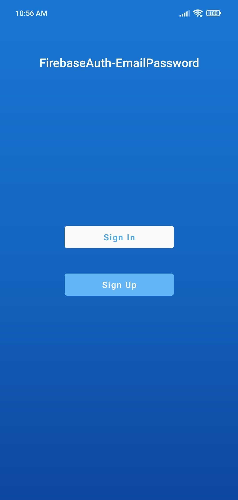
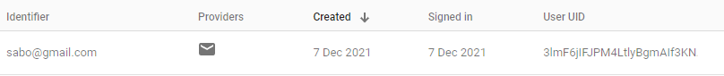

#  Firebase Authentication with Email & Password

Authentication Android application using <a href="https://firebase.google.com/">`Firebase`</a> with the login system using **email & password**

### **App Features Firebase Authentication with Email & Password** :

-   **_Firebase_**
    -   `Cloud Firestore Database`
    -   `Realtime Database`
    -   `Authentication with ` **`Email & Password`**
-   _**MaterialAlertDialog**_
    -   `CustomView BottomSheet Dialog`
-   _**SweetAlertDialog**_
    -   `Message Dialog`
    -   `Loading Dialog`

## Important!

### Add Firebase to your Android project go to <a href="https://firebase.google.com/docs/android/setup">`Firebase Setup`</a>

<br>

## Design UI App Firebase Authentication with Email & Password

### **`Preview Firebase Auth with Phone Number`**


### **`Preview UI FirebaseAuth-PhoneNumber`**

|          Name Page           |                         Preview UI                         |                        Preview UI 2                        |
| :--------------------------: | :--------------------------------------------------------: | :--------------------------------------------------------: |
|         `Home Page`          |  |                           `None`                           |
| `Sign Up BottomSheet Dialog` |  |  |
| `Sign In BottomSheet Dialog` |  |  |
|         `Main Page`          |  |  |

<br>

## Result on Firebase Console

### **`Authentication`**



### **`Realtime Database`**


### **`Cloud Firestore Database`**


<br>

## Dependencies used

```groovy
    /** Firebase */
    implementation platform('com.google.firebase:firebase-bom:29.0.1')
    implementation 'com.google.firebase:firebase-analytics'
    implementation 'com.google.firebase:firebase-auth-ktx'
    implementation 'com.google.firebase:firebase-database-ktx'
    implementation 'com.google.firebase:firebase-firestore-ktx'

    implementation 'com.github.thomper:sweet-alert-dialog:1.4.0'
    implementation 'com.afollestad.material-dialogs:core:3.3.0'
    implementation 'com.afollestad.material-dialogs:bottomsheets:3.3.0'
    implementation 'org.greenrobot:eventbus:3.3.0'
```

### Integration Step Used Binding in Kotlin

1. Add **viewBinding true** <a href="./app/build.gradle">`build.gralde (Module)`</a>

```groovy
android {
   ...
   buildFeatures {
      viewBinding true
   }
}
```

2. Activity Kotlin Class

```kotlin
class MainActivity : AppCompatActivity() {

    /** Add this */
    private lateinit var binding: ActivityMainBinding

    override fun onCreate(savedInstanceState: Bundle?) {
        super.onCreate(savedInstanceState)
        /** Add this */
        binding = ActivityMainBinding.inflate(layoutInflater)

        /** Change this */
        setContentView(binding.root)

        /** Without findViewById */
        binding.textView.text = "Bye bye findViewById"
    }
}
```

3. Activity Java Class

```java
public class MainActivity extends AppCompatActivity {

    /** Add this */
    private ActivityMainBinding binding;

    @Override
    protected void onCreate(Bundle savedInstanceState) {
        super.onCreate(savedInstanceState);
        /** Add this */
        binding = ActivityMainBinding.inflate(getLayoutInflater());

        /** Change this */
        setContentView(binding.getRoot());

        /** Without findViewById */
        binding.textView.setText("Bye bye findViewById");
    }
}
```

**binding** in kotlin can be used directly without initializing **findViewById** on widgets in layout xml
